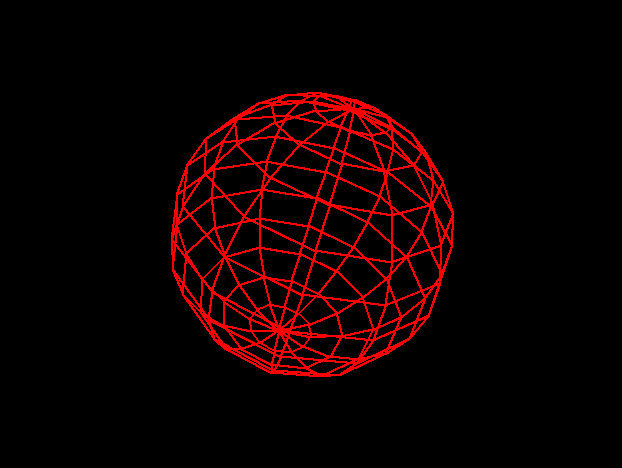

# Introdução à Matemática e Física Para Videojogos I - Final Project

This is a very rudimentary, wireframe 3d engine.

This serves as a basis for the "Introdução à Matemática e Física Para Videojogos I" final project, on the [Licenciatura em Videojogos][lv] da
[Universidade Lusófona de Humanidades e Tecnologias][ULHT] in Lisbon.

The engine was built using:

* Python 3.8
* Pygame (https://www.pygame.org/news)

There is a set of sample applications that can be run by using:
`py.exe <sample_name>.py` or `python <sample_name>.py` or `python3.6 <sample_name>.py`, depending on your Python installation.

## Assignment

The assignment for the course is as follows:
* Build a "Viewer" application. You can use any sample application as a basis. That application has to feature the following functionality:
  * Display a 3d object (see below) in the centre of the screen. Control of the visualization has to be done using the following keys:
    * Left/Right arrow: Rotate object around its Y axis
    * Up/Down arrow: Rotate object around its X axis
    * PgUp/PgDown: Rotate object around its Z axis
    * W/S: Move object up and down relative to the screen
    * A/D: Move object right and left relative to the screen
    * Q/E: Move object forward or back relative to the screen
  * Create a model for display. Allowed models are:
    * Model loaded from a file (using any file format, like JSON or OBJ). 
    * A n-sided pyramid, if no file is loaded. Number of sides on the base must be customizable through code.
    * A n-sided flat star. Number of sides on the base must be customizable through code.
    * A cylinder. Number of sides must be customizable through code.
* Build a "FPS-like" application.
  - Create an environment where the player can roam using standard FPS controls. The environment can be just a series of cubes with different scales and positions
  - Implement backface culling.
    - Backface culling stops the polygons that are facing away from the camera from being renderer
    - Hint: You can use the "face normal" and a dot product to detect these cases
    - You can check this video for a more in-depth explanation: https://www.youtube.com/watch?v=ShTiQGxiZRk
  - Implement filled geometry, replacing the wireframe
    - Hint: you'll have to sort objects by distance and draw back to front)
  - Stop objects that are behind the camera from being renderered
    - You can do this per-object, or per polygon
  - Implement very simple point lighting:
    - Create a PointLight3d class and extend the Scene class so you're able to add light(s) to it
    - Implement shading based on the light:
      - Hint: Light intensity = max(0, dot(Face Normal, Incoming Light Direction))
      - Hint: Polygon Color = Light Intensity * Color

## Project delivery

* Project is individual (for just the viewer application), or in groups of up to 3 students (for the rest)
* Git commit history will be analyzed to see individual work of students in the overall project
* Project has to be delivered up 21th January 2020 (midnight), and link delivered on the course's Moodle page
  * Deliverables have to include a link to the Github repo
    * If you want to use a private repository, instead of a public one, you can deliver all the files in a .zip file, __**INCLUDING**__ the .git directory for git usage analysis 
  * Project has to include a report, in a `readme.md` file. This report has to include the work done on the project, and the individual contributions of the group.
  * Report should also include (besides the names and numbers of students), their Github account username.
  * Report has to be formated in Markdown
  * Extra credit on reports that include a short postmortem, where students explain what went right with the project and what went wrong
* Grade will consider the following:
  * How much was achieved from the overal goals
    * Viewer application is considered the minimum viable delivery
  * Functionality and lack of bugs
  * Overall quality of code, including documentation
  * GIT usage throughout the project, as well as individual contributions of students
* Code will be verified with plagiarism detection tools, if any copy is detected, all students involved will have a zero.

## PyXYZ engine

The PyXYZ can be modified at will, full source code is available on this repo.

For more details on implementation and architecture of the engine, please refer to the sample applications and the PyXYZ.md file.

## Installation of required modules

To run the sample applications, you'll have to install all the used modules:

* `pip install pygame`

If pip is not available on the command line, you can try to invoke it through the module interface on Python:

* `python -m pip install <name of package>`

## Work on the project

We recomend building a fork of this project, and doing additional work on your repository.

* Create a copy (fork) of this repository (normally called _upstream_) in your Github account (**Fork** button in the upper right corner). The copy of the repository is usually called _origin_
* Get a local copy (on your PC) of the _origin_ repository, with the comand `git clone https://github.com/<your_username>/projecto_fp_mat_2020.git` (replace `<your username>` by your username in Github)
* Link the local repository with the remote _upstream_ repository with the command: `git remote add upstream https://VideojogosLusofona/projecto_fp_mat_2020.git`

Periodically, update your repository with changes done on the source `projecto_fp_mat_2020` repo (in case bug fixes are introduced):

* Make sure you're working on the _master_ branch:
  * `git checkout master`
* Download any updates on the projecto_fp_mat_2020 source repository by merging them with your _master_ branch:
  * `git fetch upstream`
  * `git merge upstream/master`
* Upload (_push_) the changes on _upstream_ to the _origin_ repository:
  * `git push origin master`

Do your normal work and commit/pull/push as taught. Grade will also take in account how well GIT is used throughout the project.

## Licenses

All code in this repo is made available through the [GPLv3] license.
The text and all the other files are made available through the 
[CC BY-NC-SA 4.0] license.

## Metadata

* Autor: [Diogo Andrade][]

[Diogo Andrade]:https://github.com/DiogoDeAndrade
[GPLv3]:https://www.gnu.org/licenses/gpl-3.0.en.html
[CC BY-NC-SA 4.0]:https://creativecommons.org/licenses/by-nc-sa/4.0/
[Bfxr]:https://www.bfxr.net/
[ULHT]:https://www.ulusofona.pt/
[lv]:https://www.ulusofona.pt/licenciatura/videojogos
